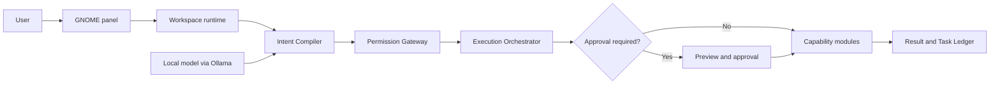

# AI-native Linux System

**A local AI assistant for Ubuntu Desktop that turns natural-language requests into controlled system actions.** A GNOME panel connects the user to a modular Python runtime. The model interprets requests; the runtime validates plans, permissions, approvals, execution, and results.

**English** · [Русский](README.ru.md)

[See the tested scenarios](labs/ai-scenario-lab/README.md) · [Explore the architecture](Architecture/AI-native-Linux-v0.1-концепция.md) · [Install the GNOME panel](apps/desktop-panel/gnome-extension/README.md)

> **Project status:** portfolio MVP for Ubuntu Desktop 24.04 LTS with GNOME. The core and main user flows have been exercised on Ubuntu. The detailed 117-case AI Scenario Lab campaign was run on Windows.

## Desktop preview


The Ubuntu VM captures show the GNOME panel before a model task is completed. The full gallery also covers app management and installation. [Browse all interface screenshots](docs/SCREENSHOTS.md).

| Settings and accent colors | System monitor |
|---|---|
|  |  |


## See the system in one task

The [copy-approved laboratory scenario](labs/ai-scenario-lab/scenarios/04-copy-approved.json) exercises this two-turn flow against the production backend inside an isolated virtual computer:

1. **“Find all PDF files on my computer.”** The system searches only enrolled, permitted storage and presents the results.
2. **“Copy them to the Mathematics folder on the Desktop.”** The system resolves “them” from the previous result, prepares a copy plan, asks for approval, and executes only after approval.

The local model proposes intent. It cannot run shell commands or approve its own actions. The runtime decides which operations exist, checks their arguments and permissions, and records the outcome.



Read-only actions can proceed without the approval step. Changing actions require a preview and a one-time user decision.

## What is built

| Area | Current implementation |
|---|---|
| Desktop experience | Native [GNOME Shell extension](apps/desktop-panel/gnome-extension/README.md) with a workspace, task progress, approvals, system health, notification preferences, and selectable accent colors. |
| Local AI and routing | [Intent Compiler](services/intent-compiler/README.md) using local Qwen through Ollama, with operations supplied by a runtime [Capability Registry](services/capability-registry/README.md). |
| Documents and files | Metadata and indexed-content search, PDF extraction, file inspection, and approved copy, move, rename, trash, and folder creation. |
| System services | Read-only [system monitoring](modules/system-monitor/README.md), bounded update checks, and on-demand module workers. |
| Security Center | Local file scans, findings, Ubuntu posture checks, and reversible quarantine with separate approval. See its [module overview](modules/security-center/README.md). |
| Accountability | [Permission Gateway](services/permission-gateway/README.md), server-owned execution plans, containment checks, and a persistent [Task Ledger](services/task-ledger/README.md). |

## Safety boundaries

- The model receives a published operation catalog and returns structured proposals; it has no direct shell, `sudo`, or D-Bus access.
- The server checks operation schemas, trusted context, permissions, risk, and available handlers before execution. A changing operation uses a preview and one-time approval.
- File access is limited to permitted resources. Copying rechecks sources before commit and handles failures without silently reporting success.
- The GNOME panel talks to the local runtime through authenticated Unix IPC. The loopback HTTP bridge is limited to read-only operations.

These are implementation boundaries, not a guarantee that every possible request or host configuration has been tested. Design decisions and contracts are linked in the [architecture documentation](Architecture/AI-native-Linux-v0.1-концепция.md).

## Verification and evidence

The latest published Foundation campaign, run on Windows with local `qwen3.5:2b`, passed **117/117** checks across seeds 7 and 19. It includes three gates, 72 scenario attempts, and 42 multi-turn journeys. The [sanitized result](labs/ai-scenario-lab/public-evidence/foundation/20260927T153344.724638Z.json), [result table](labs/ai-scenario-lab/public-evidence/README.md), and [full history](labs/ai-scenario-lab/LAB-HISTORY.md) preserve both passing and earlier failing runs. Raw prompts and traces stay local.

The regular repository tests run on Windows and Ubuntu 24.04 in [GitHub Actions](.github/workflows/ci.yml). The Ubuntu checks cover the core and Linux-specific integrations; the full live-model campaign above was performed on Windows. Main user scenarios have also been exercised on Ubuntu, without an equivalent exhaustive campaign there.

## Run and explore

For the standard test suite, from the repository root:

```bash
python -m pip install pytest pypdf zstandard
python -m pytest -q
```

On Ubuntu Desktop 24.04 LTS with GNOME, install the user service and extension:

```bash
./deployments/systemd/install-user-service.sh
bash apps/desktop-panel/gnome-extension/install.sh
```

The [runtime guide](deployments/systemd/README.md) covers prerequisites and model setup. The [testing guide](docs/developer/testing.md) explains deterministic tests, live-model evaluation, and the isolated laboratory.

## Project map

| Start here | What it contains |
|---|---|
| [`apps/desktop-panel/`](apps/desktop-panel/gnome-extension/README.md) | GNOME interface and its runtime client. |
| [`services/`](services/intent-compiler/README.md) | Intent, policy, execution, indexing, storage, and workspace services. |
| [`modules/`](modules/security-center/README.md) | First-party capabilities such as PDF, system monitoring, file operations, and Security Center. |
| [`labs/ai-scenario-lab/`](labs/ai-scenario-lab/README.md) | Real-model scenarios, journeys, evidence, and limitations. |
| [`Architecture/`](Architecture/AI-native-Linux-v0.1-концепция.md) | System concept, API contracts, and architecture decisions. |

Source code and project documentation are available under the [MIT license](LICENSE). Third-party components retain their own licenses.
