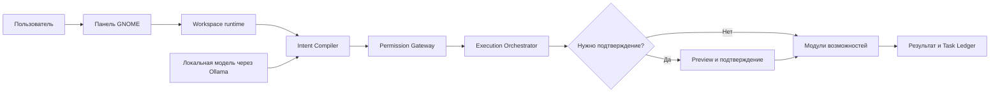

# AI-native Linux System

**Локальный AI-помощник для Ubuntu Desktop, который превращает запросы на естественном языке в контролируемые действия системы.** Панель GNOME связывает пользователя с модульным ядром на Python. Модель разбирает запрос, а ядро проверяет план, права, подтверждение, исполнение и результат.

[English](README.md) · **Русский**

[Проверенные сценарии](labs/ai-scenario-lab/README.md) · [Архитектура](Architecture/AI-native-Linux-v0.1-концепция.md) · [Установка панели GNOME](apps/desktop-panel/gnome-extension/README.md)

> **Статус проекта:** портфолио-MVP для Ubuntu Desktop 24.04 LTS с GNOME. Ядро и основные пользовательские сценарии проверялись также на Ubuntu. Подробный прогон AI Scenario Lab из 117 проверок выполнен на Windows.

## Интерфейс на Ubuntu


Снимки сделаны в Ubuntu VM до завершения задачи с моделью. В полной галерее также показаны каталог и установка приложений. [Все снимки интерфейса](docs/SCREENSHOTS.md).

| Настройки и акцентные цвета | Системный монитор |
|---|---|
|  |  |


## Один сценарий — вся цепочка

[Лабораторный сценарий копирования](labs/ai-scenario-lab/scenarios/04-copy-approved.json) проводит два запроса через рабочий backend внутри изолированного виртуального компьютера:

1. **«Найди все PDF-файлы на моём компьютере».** Система ищет только в подключённых и разрешённых хранилищах и показывает результат.
2. **«Скопируй их в папку Математика на рабочем столе».** Система связывает «их» с предыдущей выдачей, готовит план копирования, запрашивает подтверждение и исполняет его только после согласия.

Локальная модель предлагает намерение. Она не запускает команды shell и не подтверждает собственные действия. Ядро определяет доступные операции, проверяет аргументы и права, затем фиксирует результат.



Операции чтения могут выполняться без подтверждения. Изменяющие операции требуют предварительного просмотра и одноразового решения пользователя.

## Что уже реализовано

| Область | Реализация |
|---|---|
| Интерфейс | Нативное [расширение GNOME Shell](apps/desktop-panel/gnome-extension/README.md): рабочая лента, ход задач, подтверждения, состояние системы, настройка уведомлений и выбор акцентного цвета. |
| Локальная AI-цепочка | [Intent Compiler](services/intent-compiler/README.md) использует локальную Qwen через Ollama; операции поступают из [Capability Registry](services/capability-registry/README.md). |
| Документы и файлы | Поиск по метаданным и индексированному содержимому, извлечение текста PDF, просмотр сведений и подтверждаемые копирование, перемещение, переименование, отправка в корзину и создание папок. |
| Системные сервисы | Чтение [системных метрик](modules/system-monitor/README.md), ограниченная проверка обновлений и модули, запускаемые по требованию. |
| Security Center | Локальное сканирование, история находок, проверка состояния Ubuntu и обратимый карантин с отдельным подтверждением. Подробнее — в [описании модуля](modules/security-center/README.md). |
| Контроль действий | [Permission Gateway](services/permission-gateway/README.md), серверные планы исполнения, проверки изоляции и сохраняемый [Task Ledger](services/task-ledger/README.md). |

## Границы безопасности

- Модель получает опубликованный каталог операций и возвращает структурированные предложения; прямого доступа к shell, `sudo` и D-Bus у неё нет.
- Перед исполнением сервер проверяет схему операции, доверенный контекст, права, риск и доступность обработчика. Для изменений нужны preview и одноразовое подтверждение.
- Доступ к файлам ограничен разрешёнными ресурсами. Перед копированием источники проверяются повторно; ошибка не выдаётся за успех.
- Панель GNOME общается с локальным ядром по аутентифицированному Unix IPC. Loopback HTTP ограничен операциями чтения.

Это границы реализации, а не гарантия проверки любого запроса и любой конфигурации компьютера. Решения и контракты собраны в [архитектурной документации](Architecture/AI-native-Linux-v0.1-концепция.md).

## Проверки и результаты

Последний опубликованный Foundation-прогон на Windows с локальной `qwen3.5:2b` прошёл **117/117** проверок на seeds 7 и 19. В матрице три служебных gate, 72 попытки сценариев и 42 многошаговых journey. [Очищенный результат](labs/ai-scenario-lab/public-evidence/foundation/20260927T153344.724638Z.json), [таблица](labs/ai-scenario-lab/public-evidence/README.md) и [полная история](labs/ai-scenario-lab/LAB-HISTORY.md) сохраняют как успешные, так и прежние неудачные запуски. Сырые запросы и трассы остаются локально.

Обычные тесты репозитория запускаются на Windows и Ubuntu 24.04 через [GitHub Actions](.github/workflows/ci.yml). Проверки Ubuntu охватывают ядро и интеграции Linux; полный живой прогон модели выше проводился на Windows. Основные пользовательские сценарии также проверялись на Ubuntu, но столь же подробной кампании там не было.

## Запуск и знакомство с проектом

Для обычного набора тестов из корня репозитория:

```bash
python -m pip install pytest pypdf zstandard
python -m pytest -q
```

Для Ubuntu Desktop 24.04 LTS с GNOME установите панель. Её установщик также устанавливает и перезапускает пользовательский сервис runtime:

```bash
bash apps/desktop-panel/gnome-extension/install.sh
```

Нажатие на название модели рядом с кнопкой отправки открывает окно выбора установленной текстовой модели Ollama в оформлении панели. Выбор сохраняется локально и применяется к следующим запросам; во время задачи или ожидания подтверждения переключение заблокировано. Качество и поддержка действий зависят от модели; опубликованный прогон относится к проверенной конфигурации.

Предварительные требования и настройка модели описаны в [руководстве runtime](deployments/systemd/README.md). [Руководство по тестированию](docs/developer/testing.md) объясняет обычные тесты, живые проверки модели и изолированную лабораторию.

## Карта репозитория

| Начать здесь | Содержимое |
|---|---|
| [`apps/desktop-panel/`](apps/desktop-panel/gnome-extension/README.md) | Интерфейс GNOME и его runtime-клиент. |
| [`services/`](services/intent-compiler/README.md) | Сервисы намерений, политик, исполнения, индекса, хранилищ и рабочей области. |
| [`modules/`](modules/security-center/README.md) | Возможности системы: PDF, мониторинг, файловые операции, Security Center и другие. |
| [`labs/ai-scenario-lab/`](labs/ai-scenario-lab/README.md) | Сценарии с реальной моделью, journeys, доказательства и ограничения. |
| [`Architecture/`](Architecture/AI-native-Linux-v0.1-концепция.md) | Концепция, API-контракты и архитектурные решения. |

Собственный код и документация проекта доступны по [лицензии MIT](LICENSE). Сторонние компоненты сохраняют свои лицензии.
