# Ubuntu desktop screenshots / Снимки интерфейса Ubuntu

[English README](../README.md) · [Русский README](../README.ru.md)

These captures show the GNOME interface running in an Ubuntu VM. They document the panel and its settings; they do not show a completed model task. The Security Center screens include partial scan results and unavailable check values as displayed in the VM.

The application catalog captures predate the full-color icon update in extension version 10. Updated catalog screenshots will be added after the Ubuntu VM is refreshed.

Снимки показывают интерфейс GNOME в виртуальной машине Ubuntu. Они фиксируют панель и её настройки, но не показывают завершённую задачу модели. На экранах Security Center видны частичный результат проверки и значения, для которых данные в VM не получены.

Снимки каталога сделаны до обновления цветных иконок в версии расширения 10. Новые снимки каталога будут добавлены после обновления Ubuntu VM.

## Desktop and workspace / Рабочий стол и рабочая область

| Panel closed / Панель свёрнута | Workspace open / Рабочая область открыта |
|---|---|
| 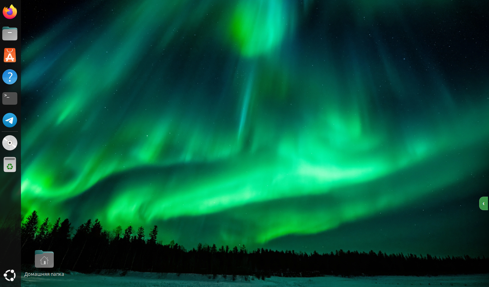 | 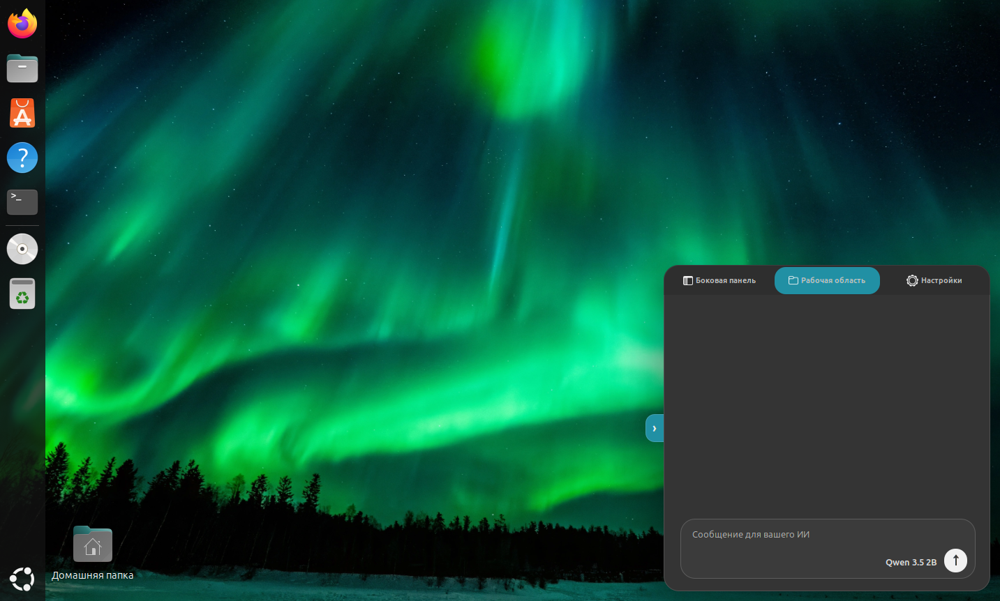 |

## Settings / Настройки

| Notifications enabled / Уведомления включены | Accent color selected / Выбран акцентный цвет |
|---|---|
| 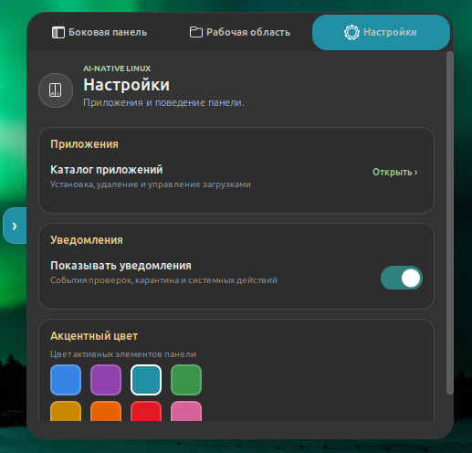 | 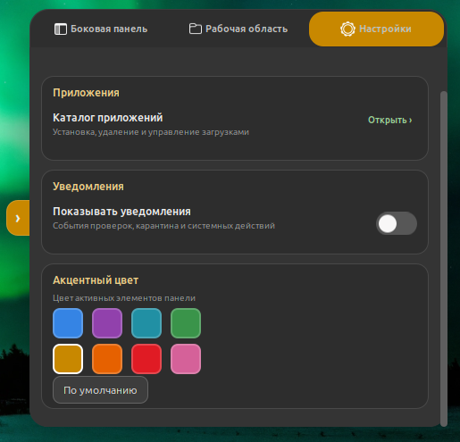 |

## Applications / Приложения

| Catalog / Каталог | Install confirmation / Подтверждение установки |
|---|---|
| 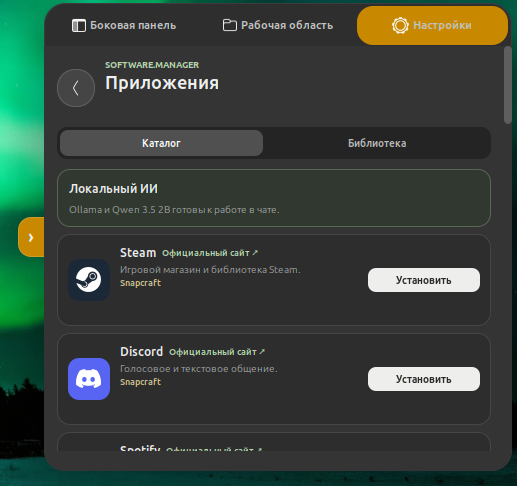 | 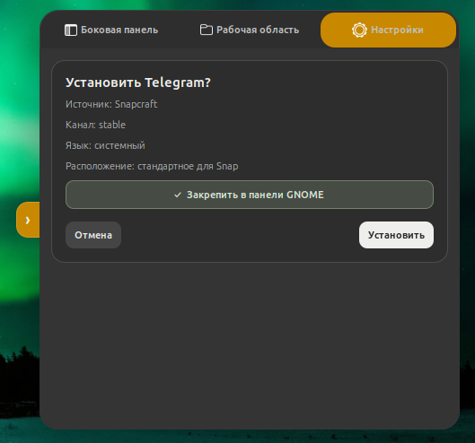 |

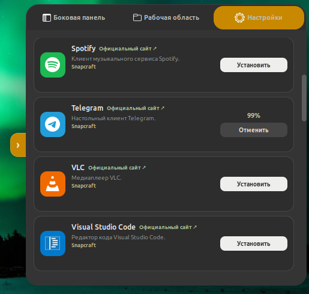

Installation progress / Ход установки приложения.

## System and tasks / Система и задачи

| System overview / Состояние системы | Mini task manager / Мини-диспетчер задач |
|---|---|
| 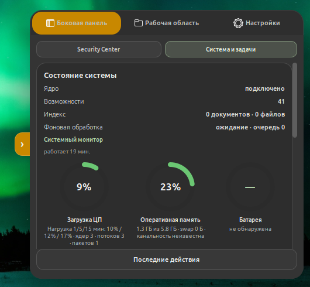 | 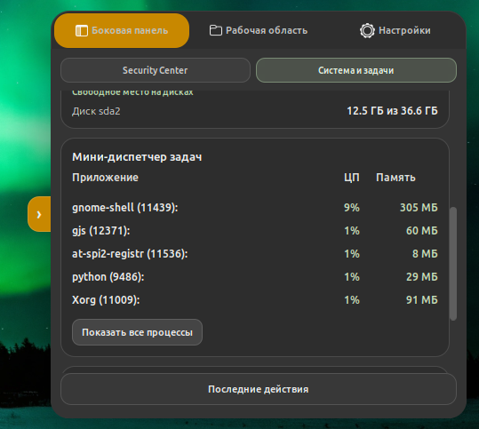 |

## Security Center

| Scan controls / Управление проверкой | Background protection / Фоновая защита |
|---|---|
| 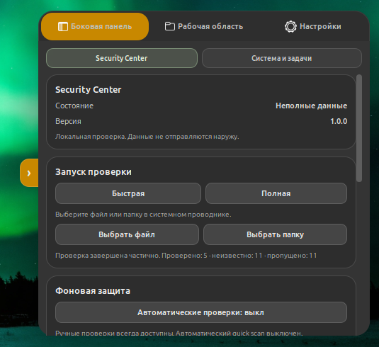 | 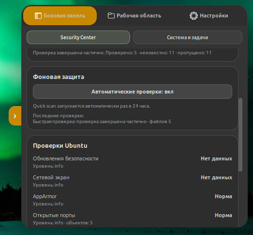 |

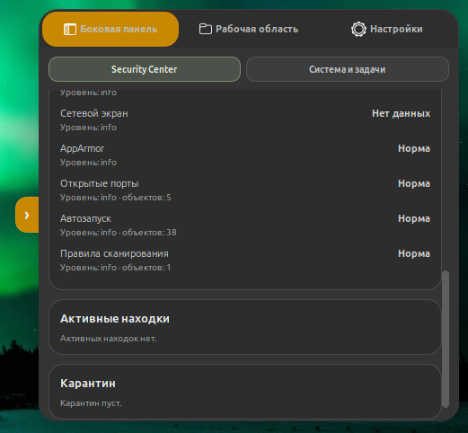

Ubuntu checks, findings, and quarantine / Проверки Ubuntu, находки и карантин.
